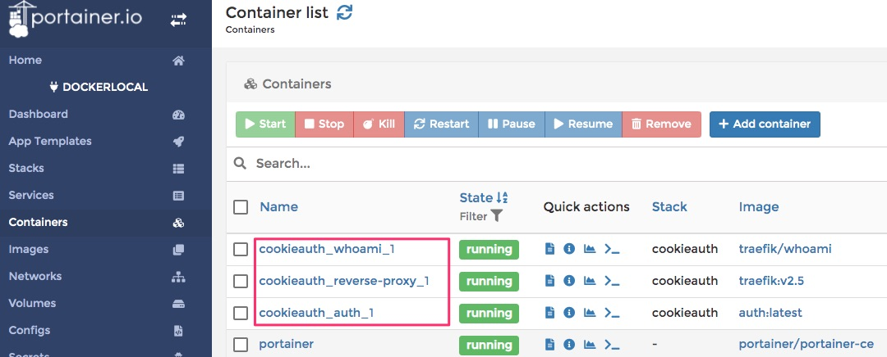
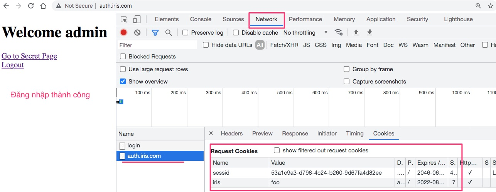

# Traefik Authentication Forwarder


## 1. Chạy thử

### 1.1 Sửa file /etc/hosts để giả lập DNS

```
sudo nano /etc/hosts
```
Thêm các dòng sau đây vào file /etc/hosts
```
127.0.0.1 auth.iris.com
127.0.0.1 whoami.iris.com
```
Kiểm tra lại bằng lệnh ping
```
ping auth.iris.com
ping whoami.iris.com
```

### 1.2 Khởi động Docker containers
```
cd CookieAuth
docker-compose up -d
```


### 1.3 Đăng nhập http://auth.iris.com/
user: admin@gmail.com
pass: 123


Nếu đăng nhập thành công hãy inspect cookie mà server gán cho client



### 1.4 Truy cập whoami.iris.com
Nhớ bước đăng nhập thành công phía trước, chúng ta có thể vào được http://whoami.iris.com


### 1.5 Logout ở http://auth.iris.com/

Sau khi logout thử vào lại http://whoami.iris.com thì sẽ bị cấm.


Nguyên nhân là do Session đăng nhập của người dùng đã bị xoá khỏi session

### 1.6 Vào log của auth.iris.com xem

Chúng ta sẽ thấy thông tin chi tiết về request được điều hướng thế nào
```
Referer:  http://whoami.iris.com/abc/def?q=ox-13
Path:  /auth
RouteName:  GET/auth
```

Đây chính là hàm quan trọng để kiểm tra đăng nhập
```go
func Authenticate(ctx iris.Context) {
	fmt.Println("Referer: ", ctx.GetReferrer())
	fmt.Println("Path: ", ctx.Path())
	fmt.Println("RouteName: ", ctx.RouteName())

	if IsLogin(ctx) {
		ctx.Next() //Cho phép đi tiếp
	} else {
		ctx.StatusCode(iris.StatusForbidden)
		return
	}
}
```