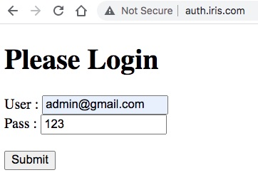
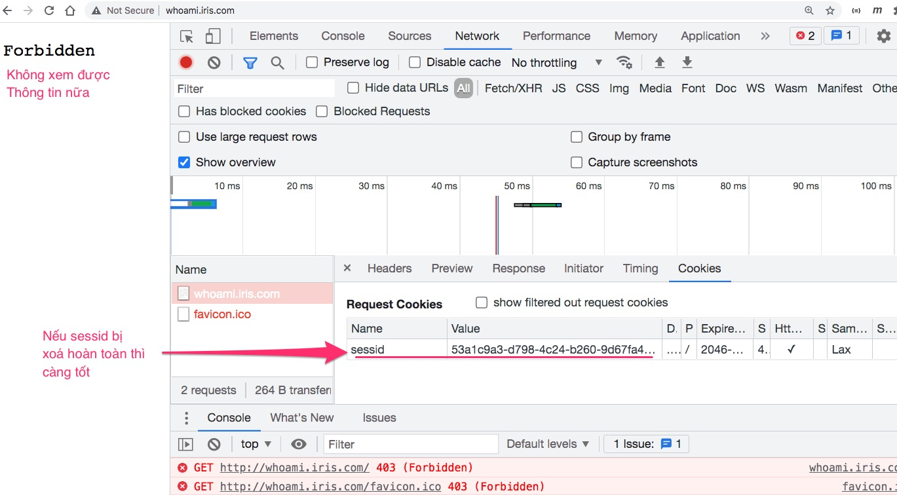

# Traefik Authentication Forwarder


## 1. Chạy thử

### 1.1 Sửa file /etc/hosts để giả lập DNS

```
sudo nano /etc/hosts
```
Thêm các dòng sau đây vào file /etc/hosts
```
127.0.0.1 auth.iris.com
127.0.0.1 whoami.iris.com
```
Kiểm tra lại bằng lệnh ping
```
ping auth.iris.com
ping whoami.iris.com
```

### 1.2 Khởi động Docker containers
```
cd CookieAuth
docker-compose up -d
```


### 1.3 Đăng nhập http://auth.iris.com/
user: admin@gmail.com
pass: 123



Nếu đăng nhập thành công hãy inspect cookie mà server gán cho client


### 1.4 Truy cập whoami.iris.com
Nhớ bước đăng nhập thành công phía trước, chúng ta có thể vào được http://whoami.iris.com


### 1.5 Logout ở http://auth.iris.com/

Sau khi logout thử vào lại http://whoami.iris.com thì sẽ bị cấm.



Nguyên nhân là do Session đăng nhập của người dùng đã bị xoá khỏi session

### 1.6 Vào log của auth.iris.com xem

Chúng ta sẽ thấy thông tin chi tiết về request được điều hướng thế nào
```
Referer:  http://whoami.iris.com/abc/def?q=ox-13
Path:  /auth
RouteName:  GET/auth
```

Đây chính là hàm quan trọng để kiểm tra đăng nhập
```go
func Authenticate(ctx iris.Context) {
	fmt.Println("Referer: ", ctx.GetReferrer())
	fmt.Println("Path: ", ctx.Path())
	fmt.Println("RouteName: ", ctx.RouteName())

	if IsLogin(ctx) {
		ctx.Next() //Cho phép đi tiếp
	} else {
		ctx.StatusCode(iris.StatusForbidden)
		return
	}
}
```

## 2. Giải thích code

### 2.1 Session là gì?
Trong một ứng dụng có nhiều người dùng và truy cập vào server, để định danh, phân biệt từng người thì web server sẽ sử dụng đến session.\
Sesion sẽ lưu trữ thông tin của người dùng dưới dạng `key : value` với key là session id của người dùng. Sau khi người dùng đăng nhập, SessionId được gắn vào cookie và trả về trình duyệt để sử dụng cho các lần truy cập sau.
```go
sess := sessions.New(sessions.Config{
		Cookie:       controller.SESSION_COOKIE,
		AllowReclaim: true,
	})
```
Đoạn code trên là để khởi tạo trình quản lý các session của iris, với config là tên của cookie cùng với tùy chọn `AllowReclaim` cho phép có thể xóa và thêm 1 session trong một request.\
Và để sử dụng session tất cả các request thì ta cần phải đăng ký một middleware xử lý session, nó sẽ đứng trước tất cả các lời gọi API, Dưới đây là câu lệnh đăng ký middleware:
```go
app.Use(sess.Handler())
```
Sau đó là các API của app:
```go
	app.Get("/", controller.ShowHomePage)
	app.Get("/secret", controller.ShowSecret)
	app.Post("/login", controller.Login)
	app.Post("/loginjson", controller.LoginJSON)
	app.Get("/logout", controller.Logout)
	app.Any("/auth", controller.Authenticate)
```

### 2.2 Xử lý đăng nhập
Khi người dùng truy cập vào ứng dụng thì server nhận request tại `app.Get("/", controller.ShowHomePage)` với controller là hàm `ShowHomePage`:
```go
func ShowHomePage(ctx iris.Context) {
	if authinfo, err := GetAuthInfo(ctx); err == nil {
		ctx.ViewData("authinfo", authinfo)
	}
	_ = ctx.View("index")
}
```
Hàm `ShowHomePage` có nhiệm vụ kiểm tra xem người dùng đã đăng nhập hay chưa bằng hàm `GetAuthInfo`, sau đó trả thông tin vào biến `authinfo` để tùy biến view templates hiển thị ra cho người dùng:
```html
<body>
  {{ if .authinfo }}
    <h1>Welcome {{ .authinfo.User }}</h1>
    <a href="/secret">Go to Secret Page</a><br>
    <a href="/logout">Logout</a>
  {{ else }}
    <h1>Please Login</h1>
    <form action="/login" method="post">
      User : <input type="text" name="Email"> <br>
      Pass : <input type="text" name="Pass"> <br><br>
      <input type="submit" value="Submit">  
    </form>
  {{ end }}  
</body>
```
Ở đoạn template trên chúng ta có thể thấy nếu người dùng đã đăng nhập thành công (`err == nil`) thì màn hình sẽ hiển thị thông tin của trang chủ. Ngược lại, màn hình sẽ hiển thị phần đăng nhập.

Khi người dùng đăng nhập, server nhận request từ `app.Post("/login", controller.Login)` với controller là hàm `Login`:
```go
func Login(ctx iris.Context) {
	var loginReq LoginRequest

	if err := ctx.ReadForm(&loginReq); err != nil {
		fmt.Println(err.Error())
		return
	}

	user, err := repo.QueryByEmail(loginReq.Email)
	if err != nil { //Không tìm thấy user
		_, _ = ctx.WriteString("Login Failed")
		return
	}

	if user.Pass != loginReq.Pass {
		_, _ = ctx.WriteString("Wrong password")
		return
	}

	session := sessions.Get(ctx)
	session.Set(SESS_AUTH, true)
	session.Set(SESS_USER, model.AuthenInfo{
		User:  user.User,
		Email: user.Email,
		Roles: user.Roles,
	})
	//Login thành công thì quay về trang chủ
	ctx.Redirect("/")
}
```

Hàm `Login` nhận vào tham số `ctx iris.Context` của iris để có thể làm việc với các request từ người dùng. Đầu tiên sẽ đọc và lưu form từ trình duyệt gửi lên vào biến `loginReq`:
```go
if err := ctx.ReadForm(&loginReq); err != nil {
		fmt.Println(err.Error())
		return
	}
```
Sau đó check email và password với CSDL bằng hàm `repo.QueryByEmail(loginReq.Email)` . Nếu thông tin người dùng match với CSDL thì session sẽ được xử lý:
- Lấy sesion đã được tạo ở middleware:
```go
	session := sessions.Get(ctx)
```
- Gán các biến lưu thông tin đăng nhập bằng hàm `Set(key, value)`:
```go
	session.Set(SESS_AUTH, true)
	session.Set(SESS_USER, model.AuthenInfo{
		User:  user.User,
		Email: user.Email,
		Roles: user.Roles,
	})
```

Từ session lưu thông tin của các lần đăng nhập đã thành công trước đó, server có thể sử dụng hàm `GetAuthInfo` để kiểm tra thông tin đăng nhập của người như đã nói ở trên:
```go
func GetAuthInfo(ctx iris.Context) (*model.AuthenInfo, error) {
	data := sessions.Get(ctx).Get(SESS_USER) // Lấy thông tin user từ session
	// Nếu data == nil đồng nghĩa với ok == false thì sẽ trả về lỗi chưa đăng nhập. Ngược lại sẽ trả về thông tin đăng nhập.
	if authinfo, ok := data.(model.AuthenInfo); ok { 
		return &authinfo, nil
	}
	return nil, errors.New("User not yet login")
}
```
### 2.3 Đăng xuất
Khi người dùng đăng xuất, server sẽ nhận request từ `app.Get("/logout", controller.Logout)` với controller là hàm `Logout`:
```go
func Logout(ctx iris.Context) {
	session := sessions.Get(ctx) // Lấy session từ middleware.
	session.Clear() // Xóa các biến lưu thông tin trong session.
	ctx.RemoveCookie(SESSION_COOKIE) // Xóa bỏ cookie có name = SESSION_COOKIE.
	ctx.Redirect("/") // Tải lại trang
}
```
