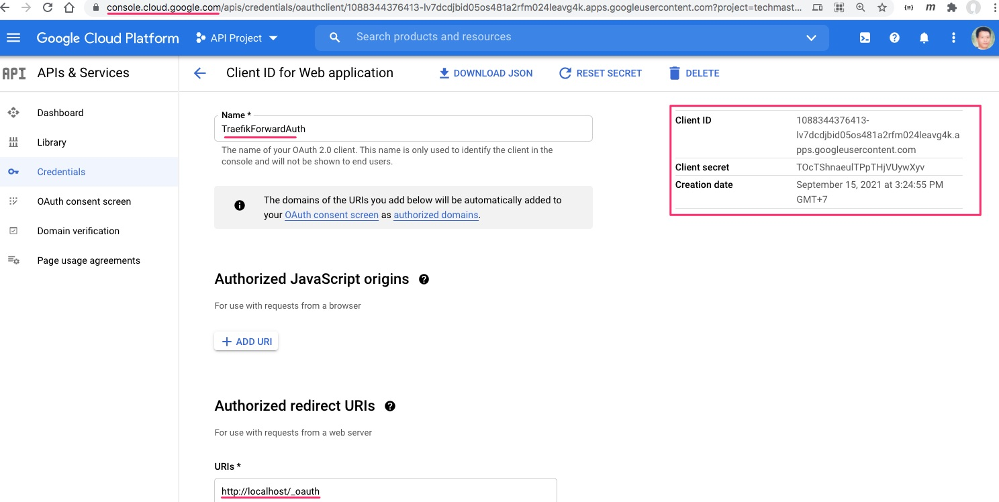

## Sử dụng traefik-forward-auth

Mục tiêu sử dụng Google OAuth để xác thực và truy cập dịch vụ whoami ở địa chỉ http://localhost

Middleware sử dụng là [https://github.com/thomseddon/traefik-forward-auth](https://github.com/thomseddon/traefik-forward-auth)


Vào https://console.cloud.google.com/ để tạo `GOOGLE_CLIENT_ID` và `GOOGLE_CLIENT_SECRET`



Triển khai thành công thì khi người dùng truy cập http://localhost, trình duyệt redirect Gmail, nếu người dùng đăng nhập thì được phép truy cập vào whoami

```yaml
version: '3.8'

services:
  traefik:
    image: traefik:v2.5
    command: --providers.docker
    ports:
      - "80:80"
      - "8080:8080"
    volumes:
      - /var/run/docker.sock:/var/run/docker.sock

  whoami:
    image: containous/whoami
    labels:
      - "traefik.http.routers.whoami.rule=Host(`localhost`)"
      # This example uses "Selective Authentication"
      - "traefik.http.routers.whoami.middlewares=traefik-forward-auth"

  traefik-forward-auth:
    image: thomseddon/traefik-forward-auth:2
    environment:
      - PROVIDERS_GOOGLE_CLIENT_ID=1088344376413-lv7dcdjbid05os481a2rfm024leavg4k.apps.googleusercontent.com
      - PROVIDERS_GOOGLE_CLIENT_SECRET=TOcTShnaeulTPpTHjVUywXyv
      - SECRET=abc123
      # INSECURE_COOKIE is required if not using a https entrypoint
      - INSECURE_COOKIE=true
      - LOG_LEVEL=debug
    labels:
      - "traefik.http.middlewares.traefik-forward-auth.forwardauth.address=http://traefik-forward-auth:4181"
      - "traefik.http.middlewares.traefik-forward-auth.forwardauth.authResponseHeaders=X-Forwarded-User"
      - "traefik.http.services.traefik-forward-auth.loadbalancer.server.port=4181"
```