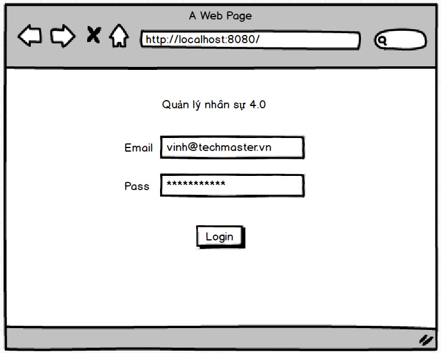
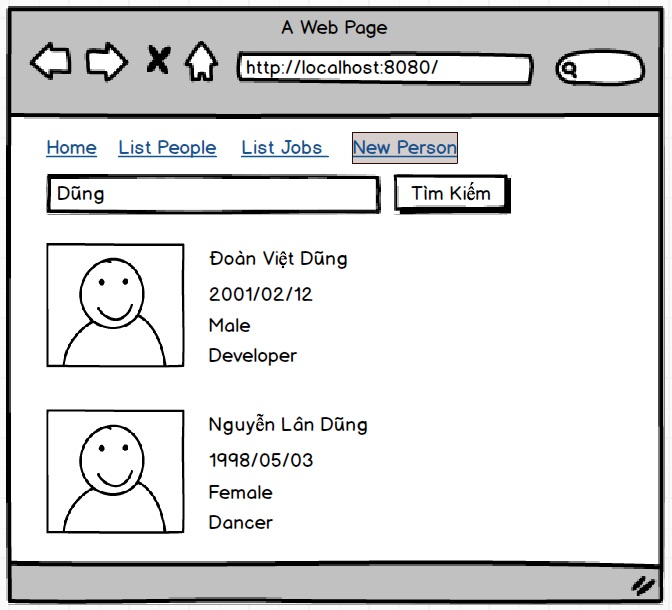
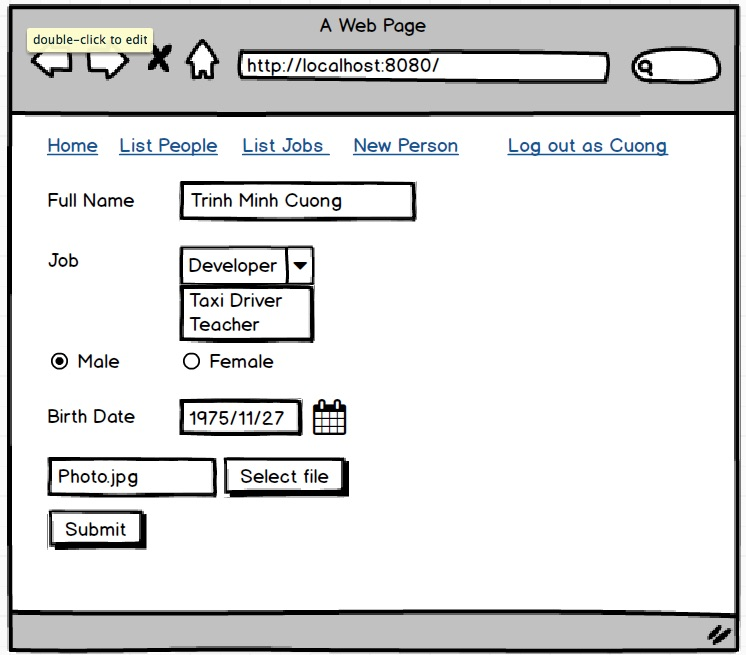

# Bài tập thực hành

Hãy lập trình một ứng dụng web sử dụng Iris framework cùng các thư viện:

- [https://github.com/TechMaster/logger](https://github.com/TechMaster/logger)
- [https://github.com/TechMaster/eris](https://github.com/TechMaster/eris)
- [rbac](https://github.com/TechMaster/LearnTraefik/tree/main/GatewayRBAC/mainsite/rbac)
- [session](https://github.com/TechMaster/LearnTraefik/tree/main/GatewayRBAC/mainsite/session)
- Không yêu cầu kết nối tạo bảng trong Postgresql, không yêu cầu dùng Redis để lưu session. Nếu cảm thấy đủ thời gian hãng làm.

Ứng dụng này có các role sau đây:

1. User không đăng nhập chỉ được xem danh sách tên, tìm kiếm theo tên
2. 'Guest' được phép xem danh sách chi tiết gồm tên, ngày sinh, giới tính, nghề nghiệp
3. 'Staff' được phép tạo mới Person,upload ảnh, cập nhật nhưng không được xoá
4. 'Editor' được phép thêm, sửa, xoá Person

Test user pass word đều là '1' gồm có:
- bob@gmail.com - Guest
- long@gmail.com - Staff
- linh@gmail.com - Editor

Giao diện không cần đẹp, không cần bootstrap, vue. Chỉ cần chạy được và hoàn thành trong một ngày từ sáng đến tối 12:00 đêm.

Nộp bài gồm code và ReadMe.md chụp ảnh màn hình đã chạy được.

